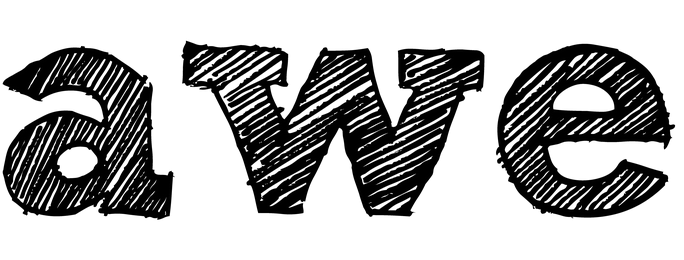

# AWE 2.0 




 A light weight workflow manager for scientific computing at scale that:

- executes [CWL](http://www.commonwl.org) workflows

- is a cloud native workflow platform designed from the ground up to be fast, scalable and fault tolerant

- supports [CWLProv](https://github.com/common-workflow-language/cwlprov)

- is RESTful. The [API](./API/) is accessible from desktops, HPC systems, exotic hardware, the cloud and your smartphone

- is designed for complex scientific computing and supports computing on multiple platforms with zero setup

- supports containerized environments with Docker and Singularity

- is part of our reproducible science platform [Skyport](https://github.com/MG-RAST/Skyport2) combined to create [Researchobjects](http://www.researchobject.org/) when combined with [CWL](http://www.commonwl.org) and [CWLProv](https://github.com/common-workflow-language/cwlprov)

<br>

AWE is actively being developed at [github.com/MG-RAST/AWE](https://github.com/MG-RAST/AWE).


You can use AWE simultaenously on Clouds, Clusters and HPC systems with dozens, hundreds or thousands of nodes to run tens of thousands to hundreds of thousands of individuals workflows. 


## AWE Quickstart
This assumes that you have `docker` and `docker-compose` installed and `curl` is available locally.

### Start AWE services

```bash
source ./init.sh
docker-compose up
```
This will start AWE server, one AWE worker, Shock object store and corresponding MongoDB containers.
Don't forget to later `docker-compose down` and do not forget, by default this demo configuration does not store data persistently.


### Submit a job for simple workflow

This example consists of CWL workflow that takes a PDF file as input, extracts all words and generates a visual wordcloud. Execute the followin command in a new terminal from within the AWE folder:

```bash
 ./awe_submit.sh -w test/tests/pdf2wordcloud.cwl -j test/tests/rules-of-acquisition.job.cwl -d tmp
```

### View result
~~~~
open image with wordle/ preview here
~~~~

## Documentation
- [API examples](./API) and [API specification](./API/api.html)
- [Building](./building.md)
- [Configuring](./config.md)


<!--
X
- [Concepts](./concepts.md)
- [Caching and data migration](./caching_and_data_migration.md)
-->

## Related software repositories and documentation


| repository  | description                           | link                                                                     |
| ----------- | ------------------------------------- | ------------------------------------------------------------------------ |
| AWE monitor | UI for the AWE server                 | [github.com/MG-RAST/awe-monitor](https://github.com/MG-RAST/awe-monitor) |
| Shock       | object store                          | [github.com/MG-RAST/Shock](https://github.com/MG-RAST/Shock)             |
| Skyport2    | demo environment using docker-compose | [github.com/MG-RAST/Skyport2](https://github.com/MG-RAST/Skyport2)       |


## Papers to cite

* W. Tang, J. Wilkening, N. Desai, W. Gerlach, A. Wilke, F. Meyer, "A scalable data analysis platform for metagenomics," in Proc. of IEEE International Conference on Big Data, 2013.[[ieeexplore]](http://ieeexplore.ieee.org/xpl/articleDetails.jsp?arnumber=6691723) [[pdf]](http://www.mcs.anl.gov/papers/P5012-0913_1.pdf)

* W. Gerlach, W. Tang, K. Keegan, T. Harrison, A. Wilke, J. Bischof, M. D'Souza, S. Devoid, D. Murphy-Olson, N. Desai, F. Meyer, "Skyport – Container-Based Execution Environment Management for Multi-Cloud Scientific Workflows," in Proc. of the 5th International Workshop on Data Intensive Computing in the Clouds, 2014. [[pdf]](https://www.mcs.anl.gov/papers/P5209-1014.pdf)

